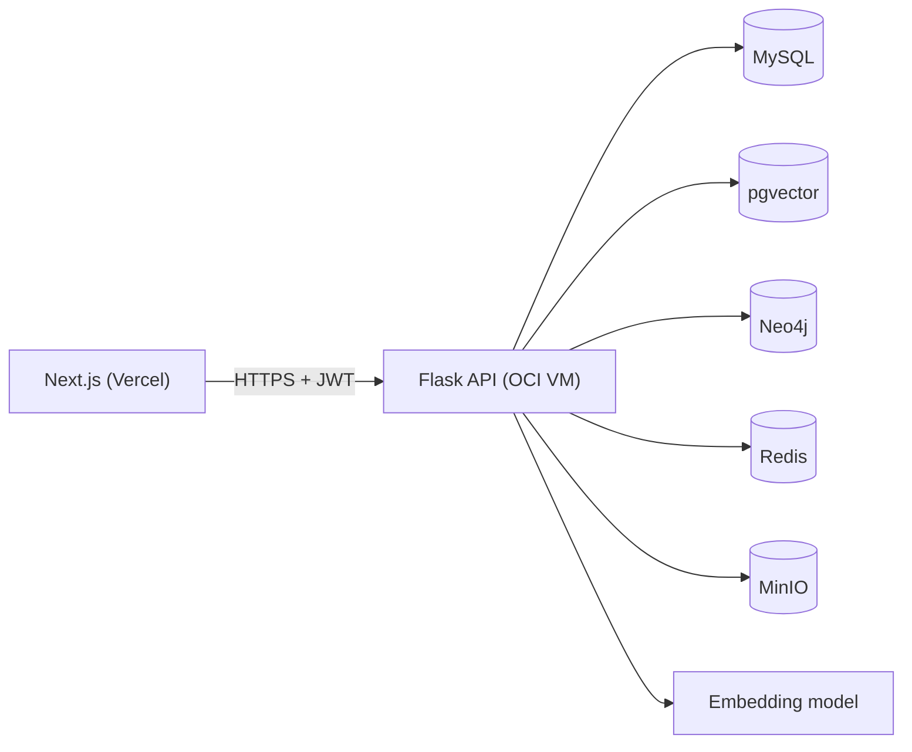

# Architecture

## Stack

- **Frontend:** Next.js — hosted on Vercel
- **Backend:** Python + Flask (REST API) — hosted on OCI VM
- **Relational DB:** MySQL 8.0 — on OCI VM
- **Vector DB:** PostgreSQL + pgvector extension — on OCI VM
- **Graph DB:** Neo4j (Docker container) — on OCI VM
- **Cache:** Redis — on OCI VM
- **File storage:** MinIO (Docker container, S3-compatible) — on OCI VM
- **Embedding model:** `sentence-transformers/all-MiniLM-L6-v2` — runs in Flask process on OCI VM
- **Auth:** JWT (issued by Flask, verified on every protected request)

---

## System flow

---

## Modules

- `auth` — register, login, logout. Issues and verifies JWTs. Handles password hashing with bcrypt. Owns the `users` table.
- `documents` — receives PDF upload from client, stores the file in MinIO, parses text with PyMuPDF, splits into sentence-boundary-aware chunks, embeds each chunk via the embedding model, writes document metadata to MySQL and chunk vectors to pgvector. Also handles document deletion and listing.
- `search` — accepts a plain-English query, embeds it, runs cosine similarity search on pgvector. If the best match distance exceeds 0.75, falls back to MySQL FULLTEXT search. Logs every search to `search_log` and writes top results to `search_results`. Calls `cache` before hitting pgvector.
- `cache` — Redis read/write/invalidate layer. Key format: `search:{user_id}:{md5(query)}`. TTL: 3600s. Invalidates a user's cache on new document upload. Used by `search`; reusable across other modules.
- `graph` — on document upload, writes `(Document)-[:ABOUT]->(Topic)` nodes and relationships to Neo4j using manually assigned topic tags. Exposes a query to find related documents by shared topics.
- `analytics` — read-only reporting module. Serves search history ranked with window functions, unsearched documents via CTE, and top documents via the `top_documents` view. No writes.

---

## API contract

| Method | Path | Request | Response |
| --- | --- | --- | --- |
| POST | `/api/auth/register` | `{ name, email, password }` | `{ user_id, token }` |
| POST | `/api/auth/login` | `{ email, password }` | `{ user_id, token }` |
| POST | `/api/auth/logout` | — | `{ message }` |
| GET | `/api/documents` | — | `[{ doc_id, title, uploaded_at }]` |
| POST | `/api/documents/upload` | `form-data: file, topics[]` | `{ doc_id, chunk_count }` |
| DELETE | `/api/documents/:doc_id` | — | `{ message }` |
| GET | `/api/documents/:doc_id/related` | — | `[{ doc_id, title, shared_topics }]` |
| POST | `/api/search` | `{ query }` | `[{ chunk_id, doc_title, snippet, score }]` |
| GET | `/api/analytics/history` | — | `[{ query, search_count, rank }]` |
| GET | `/api/analytics/unsearched` | — | `[{ doc_id, title, uploaded_at }]` |
| GET | `/api/analytics/top-documents` | — | `[{ title, appearance_count, avg_score }]` |

All protected routes require `Authorization: Bearer <token>` header.

---

## Data model

- `User` — has many `Documents`, has many `SearchLogs`
- `Document` — belongs to `User`, has many `Chunks`, has many `Topics` (via `DocTopics`)
- `Chunk` — belongs to `Document`, carries the embedding vector, appears in many `SearchResults`
- `Topic` — has many `Documents` (via `DocTopics`)
- `SearchLog` — belongs to `User`, has many `SearchResults`
- `SearchResult` — belongs to `SearchLog`, references a `Chunk`, carries rank and similarity score

---

## Constraints

- **Scale:** Single-user to small group (~10 users, ~500 documents max). No horizontal scaling needed.
- **Performance:** Search must return results within 3 seconds end-to-end including embedding. Upload processing can be async — user gets a confirmation immediately, chunking happens in the background.
- **Security:** All API routes are JWT-protected except `/register` and `/login`. Flask CORS restricted to Vercel frontend origin only. Passwords hashed with bcrypt, never stored plain.
- **Chunking:** Sentence-boundary aware, targeting ~200 words per chunk with 1–2 sentence overlap. Implemented with `nltk.sent_tokenize`.
- **Similarity threshold:** Cosine distance > 0.75 triggers FULLTEXT fallback. Hardcoded for v1, extractable to config later.
- **No offline support, no mobile, no multi-tenancy** — out of scope for v1.